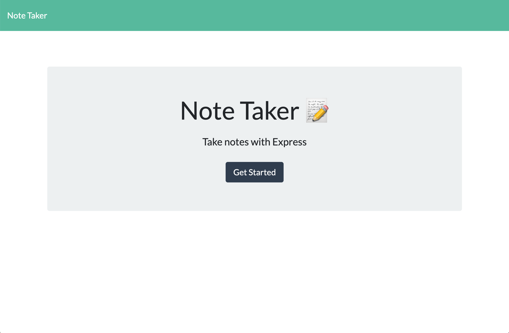

# Note-Taker

This application allows the user to create, save and delete notes

## Table of Contents 

- [Technologies](#tech)
- [Instalation](#install)
- [Usage](#output)
- [Contribute](#contribute)
- [Questions](#email)
- [License](#license)

### Technologies

 The technologies utilized in this application are as follows: express, and HTML, CSS, Javascript, Express.

### Instalation

 To run this application successfully follow these steps:
  1. Install [Note-Taker](https://safe-anchorage-75068.herokuapp.com/) to your local drive via terminal/GitBash. This will install the package.json file which contains a list of all the dependencies for this application. 

  2. Verify that node is installed on your computer by typing 'node' in your terminal/GitBash. If it returns
    >Welcome to Node.js V12.14.1 (or higher)
    >
    >Type '.help' for more information.

    Node.js is installed on your computer.
  3. Type 'npm install' in your terminal to install the dependencies. 

### Usage

 The purpose of this program is to solve This application serves as a virtual post it note, allowing the user to create reminders, things to remember for later, grocery lists etc that they can access at a later time without using actual pen and paper.. The following is the expected output of the application: The application should have a Note Taker homepage that has a link that takes the user to a page where they can create a note and save it. They can also delete any of the notes they have created on this page.

### Contribute
 
 Contrubutions are to this application are welcome to imporve it's functionality. If you would like to contribute to this application please contact me at the email address listed in the questions section.

### Questions

 Any questions and/or comments are welcome. Please contact me at e_marie84@ymail.com or visit my [Github Profile](https://github.com/erinmarie84)

 ### License

 Licensed under the MIT license. 
